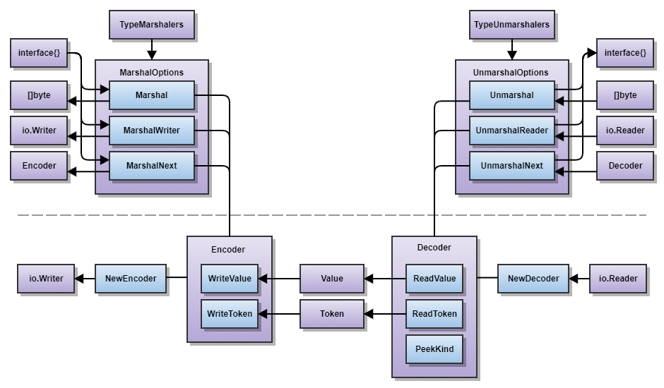

# JSON Serialization (v2)

This module hosts an experimental implementation of v2 `encoding/json`.
The API is unstable and breaking changes will regularly be made.
Do not depend on this in production.

## Goals and objectives

* **Mostly backwards compatible:** If possible, v2 should aim to be _mostly_
compatible with v1 in terms of both API and default behavior to ease migration.
For example, the `Marshal` and `Unmarshal` functions are the most widely used
declarations in the v1 package. It seems sensible for equivalent functionality
in v2 to be named the same and have the same signature.
Behaviorally, we should aim for 95% to 99% backwards compatibility.
We do not aim for 100% compatibility since we want the freedom to break
certain behaviors that are now considered to have been a mistake.
We may provide options that can bring the v2 implemention to 100% compatibility,
but it will not be the default.

* **More flexible:** There is a
[long list of feature requests](https://github.com/golang/go/issues?q=is%3Aissue+is%3Aopen+encoding%2Fjson+in%3Atitle).
We should aim to provide the most flexible features that addresses most usages.
We do not want to over fit the v2 API to handle every possible use case.
Ideally, the features provided should be orthogonal in nature such that
any combination of features results in as few surprising edge cases as possible.

* **More performant:** JSON serialization is widely used and any bit of extra
performance gains will be greatly appreciated. Some rarely used behaviors of v1
may be dropped in favor of better performance. For example,
despite `Encoder` and `Decoder` operating on an `io.Writer` and `io.Reader`,
they do not operate in a truly streaming manner,
leading to a loss in performance. The v2 implementation should aim to be truly
streaming by default (see [#33714](https://golang.org/issue/33714)).

* **Easy to use (hard to misuse):** The v2 API should aim to make
the common case easy and the less common case at least possible.
The API should avoid behavior that goes contrary to user expectation,
which may result in subtle bugs (see [#36225](https://golang.org/issue/36225)).

* **v1 and v2 maintainability:** Since the v1 implementation must stay forever,
it would be beneficial if v1 could be implemented under the hood with v2,
allowing for less maintenance burden in the future. This probably implies that
behaviorial changes in v2 relative to v1 need to be exposed as options.

* **Avoid unsafe:** Standard library packages generally avoid the use of
package `unsafe` even if it could provide a performance boost.
We aim to preserve this property.

## Expectations

While this module aims to possibly be the v2 implementation of `encoding/json`,
there is no guarantee that this outcome will occur. As with any major change
to the Go standard library, this will eventually go through the
[Go proposal process](https://github.com/golang/proposal#readme).
At the present moment, this is still in the design and experimentation phase
and is not ready for a formal proposal.

There are several possible outcomes from this experiment:
1. We determine that a v2 `encoding/json` would not provide sufficient benefit
over the existing v1 `encoding/json` package. Thus, we abandon this effort.
2. We propose a v2 `encoding/json` design, but it is rejected in favor of some
other design that is considered superior.
3. We propose a v2 `encoding/json` design, but rather than adding an entirely
new v2 `encoding/json` package, we decide to merge its functionality into
the existing v1 `encoding/json` package.
4. We propose a v2 `encoding/json` design and it is accepted, resulting in
its addition to the standard library.
5. Some other unforeseen outcome (among the infinite number of possibilities).

## Development

This module is primarily developed by [@dsnet](https://github.com/dsnet) and [@mvdan](https://github.com/mvdan)
with feedback provided by [@rogpeppe](https://github.com/rogpeppe), [@ChrisHines](https://github.com/ChrisHines), and [@rsc](https://github.com/rsc).

Discussion about semantics occur semi-regularly, where a
[record of past meetings can be found here](https://docs.google.com/document/d/1rovrOTd-wTawGMPPlPuKhwXaYBg9VszTXR9AQQL5LfI/edit?usp=sharing).

## Design overview

This package aims to provide a clean separation between syntax and semantics.
Syntax deals with the structural represention of JSON (as specified in
[RFC 7159](https://tools.ietf.org/html/rfc7159),
[RFC 7493](https://tools.ietf.org/html/rfc7493),
[RFC 8259](https://tools.ietf.org/html/rfc8259), and
[RFC 8785](https://tools.ietf.org/html/rfc8785)).
Semantics deals with the meaning of syntactic data as usable application data.

The `Encoder` and `Decoder` types are streaming tokenizers concerned with
the packing or parsing of JSON data. They operate on `Token` and `Value` types
which represent the common data structures that are representable in JSON.
`Encoder` and `Decoder` do not aim to provide any interpretation of the data.

Functions like `Marshal`, `MarshalFull`, `MarshalNext`, `Unmarshal`,
`UnmarshalFull`, and `UnmarshalNext` provide semantic meaning by correlating
any arbitrary Go type with some JSON representation of that type (as stored in
data types like `[]byte`, `io.Writer`, `io.Reader`, `Encoder`, or `Decoder`).

This diagram provides a high-level overview of the v2 `json` package.
Purple blocks represent types, while blue blocks represent functions or methods.
The arrows and their direction represent the approximate flow of data.
The bottom half of the diagram contains functionality that is only concerned
with syntax, while the upper half contains functionality that assigns
semantic meaning to syntactic data handled by the bottom half.

In contrast to v1 `encoding/json`, options are represented as separate types
rather than being setter methods on the `Encoder` or `Decoder` types.
