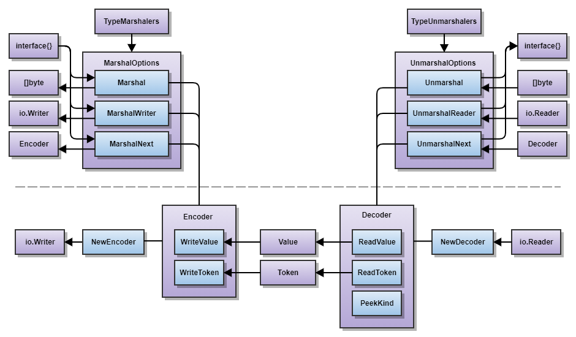

# JSON Serialization (v2)

This module currently hosts a mirror of `encoding/json/v2`.
Importing this package with the `goexperiment.jsonv2` build tag
(which is enabled by default on Go 1.27) will alias the implementation
in the Go standard library.

This module contained the historical prototype of `encoding/json/v2`
before it was formally adopted into the Go standard library
as an experiment in Go 1.25 and then later as a stable API in Go 1.27.

## Development

This module was primarily developed by
[@dsnet](https://github.com/dsnet),
[@mvdan](https://github.com/mvdan), and
[@johanbrandhorst](https://github.com/johanbrandhorst)
with feedback provided by
[@rogpeppe](https://github.com/rogpeppe),
[@ChrisHines](https://github.com/ChrisHines), and
[@rsc](https://github.com/rsc).
During the process to adopt the project into the Go standard library,
API review was provided by
[@aclements](https://github.com/aclements),
[@neild](https://github.com/neild), and
[@prattmic](https://github.com/prattmic).

Discussion about semantics occur semi-regularly, where a
[record of past meetings can be found here](https://docs.google.com/document/d/1rovrOTd-wTawGMPPlPuKhwXaYBg9VszTXR9AQQL5LfI/edit?usp=sharing).

## Design overview

This package aims to provide a clean separation between syntax and semantics.
Syntax deals with the structural representation of JSON (as specified in
[RFC 4627](https://tools.ietf.org/html/rfc4627),
[RFC 7159](https://tools.ietf.org/html/rfc7159),
[RFC 7493](https://tools.ietf.org/html/rfc7493),
[RFC 8259](https://tools.ietf.org/html/rfc8259), and
[RFC 8785](https://tools.ietf.org/html/rfc8785)).
Semantics deals with the meaning of syntactic data as usable application data.

The `Encoder` and `Decoder` types are streaming tokenizers concerned with the
packing or parsing of JSON data. They operate on `Token` and `Value` types
which represent the common data structures that are representable in JSON.
`Encoder` and `Decoder` do not aim to provide any interpretation of the data.

Functions like `Marshal`, `MarshalWrite`, `MarshalEncode`, `Unmarshal`,
`UnmarshalRead`, and `UnmarshalDecode` provide semantic meaning by correlating
any arbitrary Go type with some JSON representation of that type (as stored in
data types like `[]byte`, `io.Writer`, `io.Reader`, `Encoder`, or `Decoder`).

This diagram provides a high-level overview of the v2 `json` and `jsontext` packages.
Purple blocks represent types, while blue blocks represent functions or methods.
The arrows and their direction represent the approximate flow of data.
The bottom half of the diagram contains functionality that is only concerned
with syntax (implemented by the `jsontext` package),
while the upper half contains functionality that assigns
semantic meaning to syntactic data handled by the bottom half
(as implemented by the v2 `json` package).

In contrast to v1 `encoding/json`, options are represented as separate types
rather than being setter methods on the `Encoder` or `Decoder` types.
Some options affects JSON serialization at the syntactic layer,
while others affect it at the semantic layer.
Some options only affect JSON when decoding,
while others affect JSON while encoding.

## Performance

One of the goals of the v2 module is to be more performant than v1,
but not at the expense of correctness.
In general, v2 is at performance parity with v1 for marshaling,
but dramatically faster for unmarshaling.

See https://github.com/go-json-experiment/jsonbench for benchmarks
comparing v2 with v1 and a number of other popular JSON implementations.
